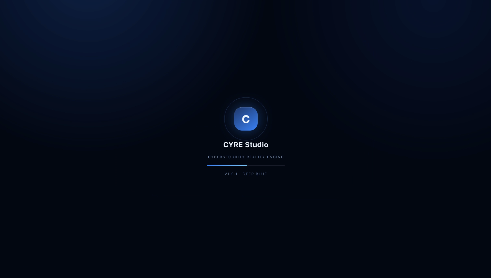
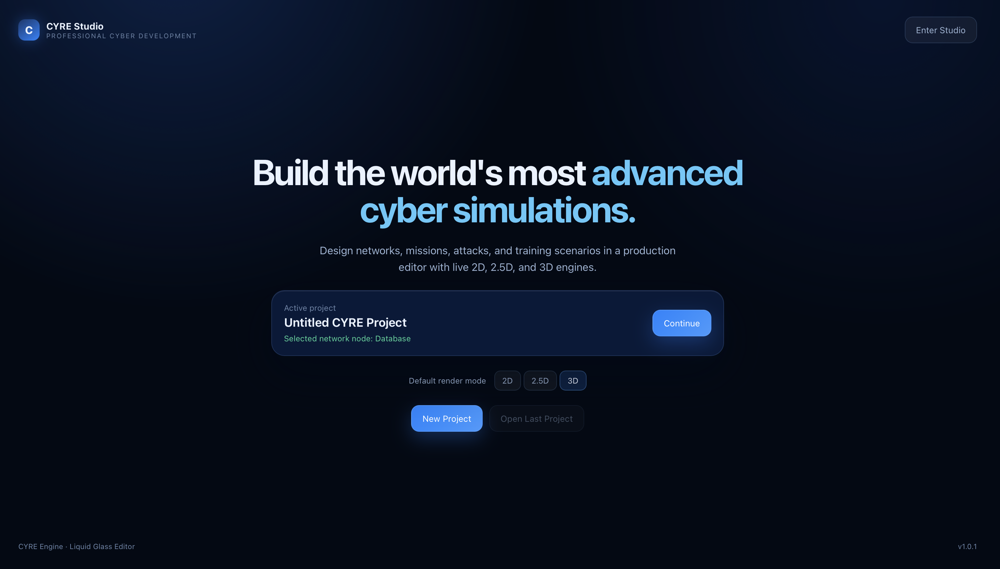
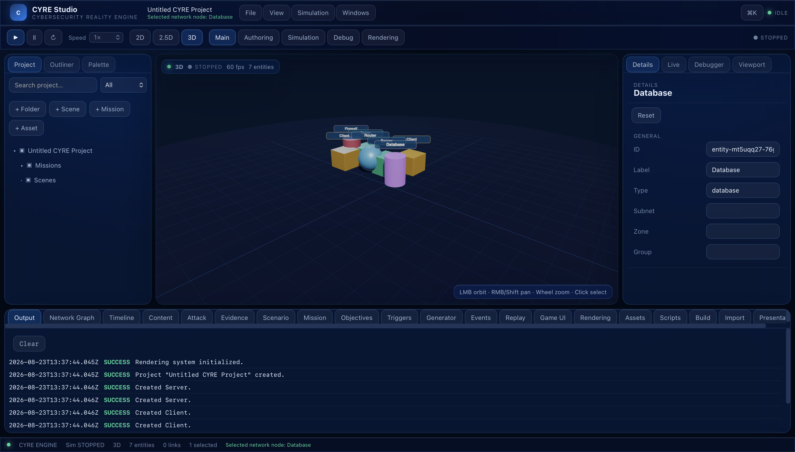
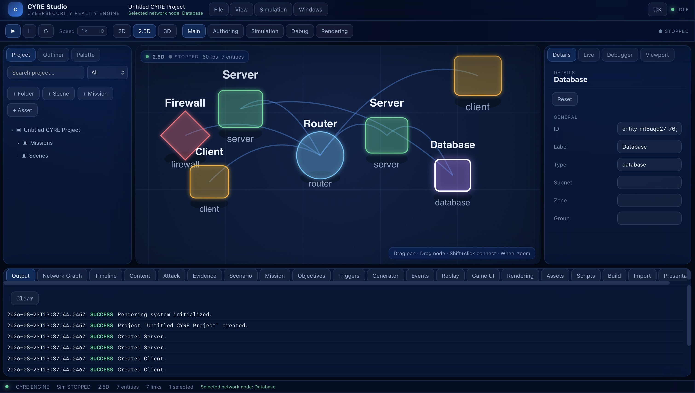
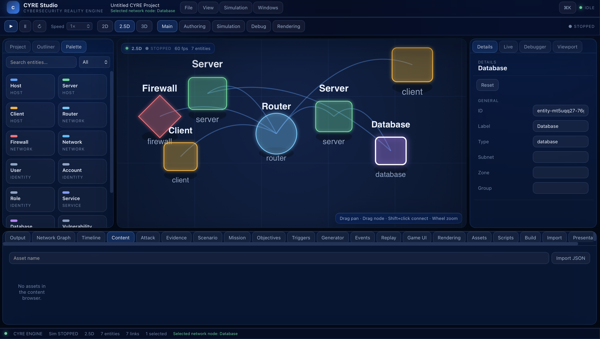
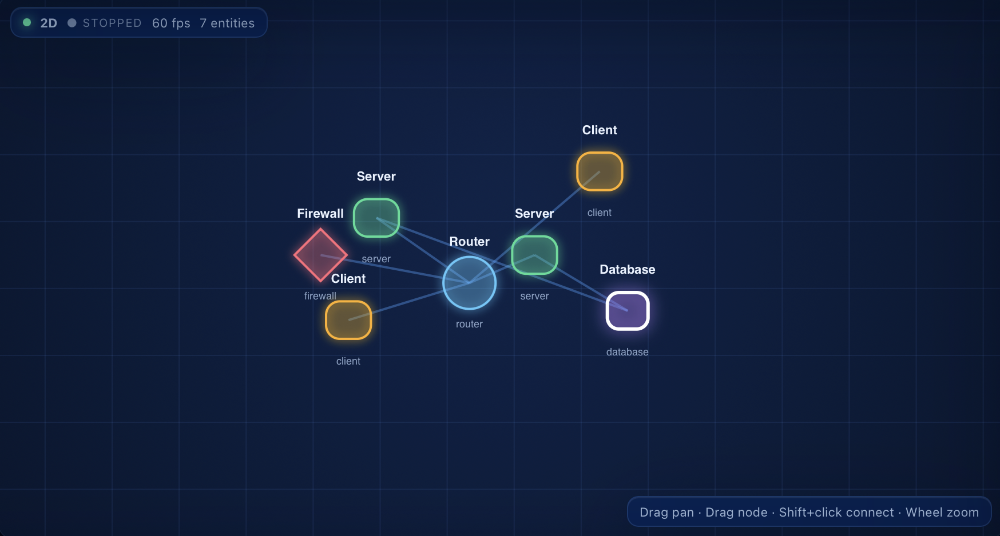

# CYRE — Cybersecurity Reality Engine

**Domain-Specific Game & Simulation Engine for Cybersecurity**

CYRE is a modular, extensible, domain-specific game and simulation engine designed specifically for building high-quality interactive cybersecurity games and cyber-simulation applications.

> **Status:** Professional release verification — CYRE Studio 1.0.1 ready.  
> Current release: **1.0.1**

---

## Project Identity

- **Project Name:** CYRE (Cybersecurity Reality Engine)
- **Owner:** ForgeX4 / Kian M.J.
- **Repository:** [sirkianmj/Forgex4-CYRE](https://github.com/sirkianmj/Forgex4-CYRE)
- **License:** Proprietary — All rights reserved
- **Primary Language:** TypeScript
- **Domain:** Cybersecurity simulation, serious games, education, research

---

## Vision

CYRE makes cybersecurity itself a first-class engine concept.

It is **not** a general-purpose game engine; it is a specialised platform for cyber simulation, education, training, and research.

The engine powers a flagship cybersecurity investigation and strategy game where players assume roles such as SOC analyst, incident responder, threat hunter, or security engineer.

---

## Core Objectives

1. **Simulation First** — The underlying cyber world maintains real state; actions change the simulation.
2. **Domain-Specific by Design** — Cybersecurity concepts are native engine primitives, not bolted-on mechanics.
3. **Rendering Independent** — The same scenario can be displayed as 2D, 2.5D, or 3D without changing the simulation.
4. **Cross-Platform** — Games built on CYRE deploy to web, iOS, Android, desktop, and potentially consoles.
5. **Research-Grade** — Deterministic scenarios, telemetry, and reproducibility enable academic research.

---

## Monorepo Structure
```bash
CYRE
├── engine # Core engine code (TypeScript)
├── game # Flagship game implementation
├── tools # Editor, CLI, and developer tools
├── research # Research scripts, notebooks, analytics
├── docs # Documentation
└── experiments # Experimental prototypes and spikes

```

---

## Technology Direction

- **Core:** TypeScript
- **Frontend / UI:** React + TypeScript
- **Rendering:** WebGL/WebGPU-compatible, initial 2D focus
- **Backend:** Node.js + TypeScript
- **Packaging:** Cross-platform wrapper (mobile/desktop)
- **Database:** PostgreSQL (future)
- **Automation:** REST / WebSockets / Webhooks → n8n

---

## Current Status

CYRE v1.0.4 is released.

CYRE Studio provides a professional editor with real 2D, 2.5D, and 3D viewports, asset import/export, Mission 001 playthrough, live simulation, replay, debugger, and build/deploy tools.

The architecture remains modular and cybersecurity-specific. See [CHANGELOG.md](CHANGELOG.md) for release details.


## Roadmap

CYRE is released as a professional, modular, domain-specific engine and development environment. The roadmap reflects the CYRE Studio trajectory and the original specification, not a generic sprint checklist.

### Current release

- CYRE Engine: modular simulation kernel, cyber world, network/identity, attack/defense, scenarios, missions, evidence, investigation, debug/timeline/replay, telemetry/research, automation, platform packaging.
- CYRE Studio: professional React editor with project launcher, docking/workspace windows, 2D/2.5D/3D viewports, command palette, inspector, project explorer, authoring tools, play mode, debug/replay, asset import/export, build/deploy panels.
- Verification: engine tests (134 suites / 1,426 tests), studio tests (42), architecture audit clean.

### Professional milestones

1. Engine and API hardening: public API policy, module contracts, serialization stability, performance/security audits.
2. Project and serialization foundation: templates, migrations, recent projects, project settings.
3. Editor completeness: workspace presets, docking polish, command/shortcut search, visual polish and accessibility.
4. Visual graph editors: network, attack, evidence, timeline, scenario generator, validation UX.
5. Gameplay/runtime: live simulation inspector, stepping, replay studio, debugger, profiler, adaptive scenario engine.
6. Asset and extensibility: real import/export pipelines, previews, scripting API, plugin manager.
7. Rendering: production 2D/2.5D, optional 3D foundation; keep simulation independent.
8. Cross-platform and CI/CD: web/desktop/mobile packaging, release channels, crash reporting.
9. Research and automation: experiment runner, dataset export, webhooks/n8n.
10. Flagship vertical slice: complete playable campaign and a real-world developer test.

### Explicit non-goals

- Do not become a general-purpose Unreal/Unity replacement.
- Do not build custom physics, AAA renderer, or massive open worlds.
- Advanced 3D only after the simulation/editor foundation is mature.
- Integrate mature technologies behind CYRE's abstraction.

See docs/roadmap.md for the historical sprint plan.


## Ownership & Licensing

CYRE is proprietary software owned by **ForgeX4 / Kian M.J.**  
All rights reserved. See [LICENSE](LICENSE) and [OWNERSHIP.md](OWNERSHIP.md) for details.

Third-party notices are documented in [THIRD_PARTY_NOTICES.md](THIRD_PARTY_NOTICES.md).  
Project governance is described in [GOVERNANCE.md](GOVERNANCE.md).

---
## Screenshots







[Watch: Editor](docs/screenshots/editor.mp4)
[Watch: Loading](docs/screenshots/loading.mp4)


## Development

### Prerequisites

- macOS with Xcode Command Line Tools
- Homebrew
- Git
- GitHub CLI
- Node.js LTS
- pnpm
- Miniforge (Conda) with `cyre-research` environment

### Setup

```bash
# Clone repository
git clone <repo-url>
cd CYRE

# Install dependencies (future sprints)
pnpm install
Research Goals

CYRE is designed as a research platform for experimentally studying:

Procedural cybersecurity scenario generation
Adaptive cyber training
Human decision-making in simulated cyber environments
AI agents in cyber defense/attack
Cybersecurity education effectiveness
The engine records structured telemetry for reproducible experiments.

Contribution Policy

Contributions are currently closed while the project is in early private development.
When public contribution opens, contributors will be required to sign a Contributor License Agreement (CLA).
See CONTRIBUTING.md for details.

Contact

For inquiries, contact ForgeX4 (contact information will be provided separately).

License

This project is proprietary. All rights reserved.
See LICENSE for details.
