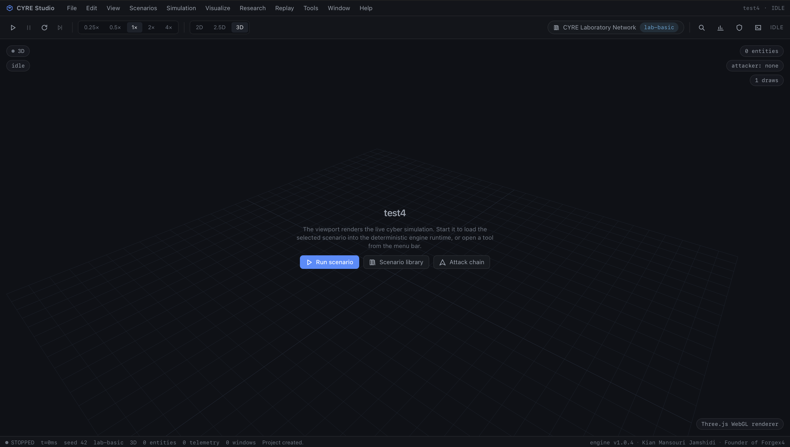
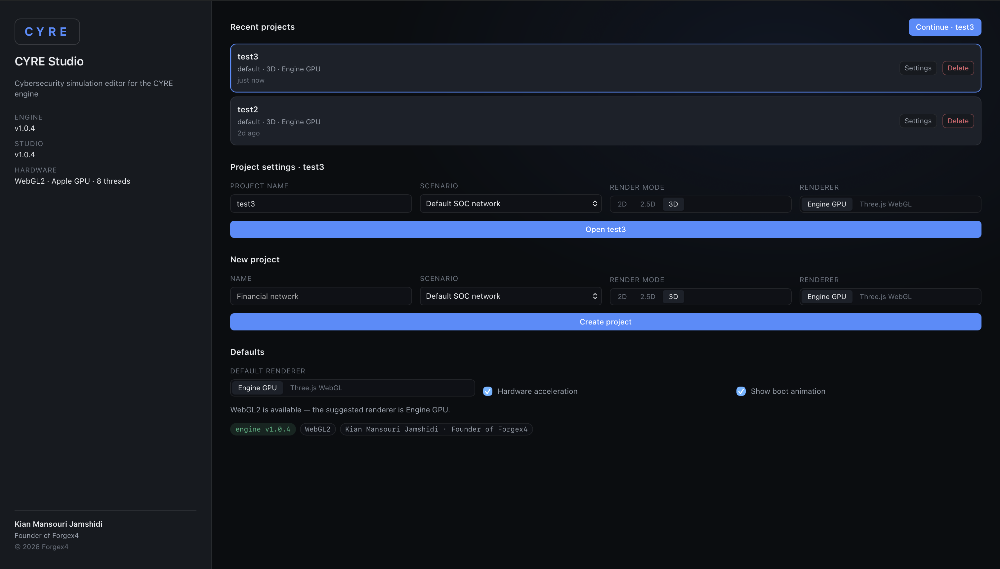
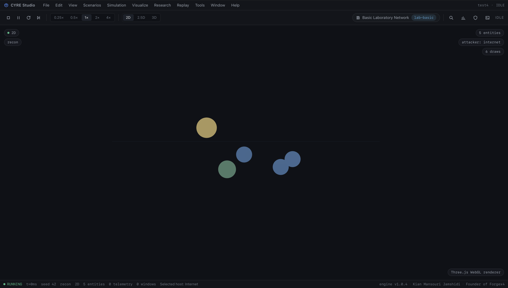
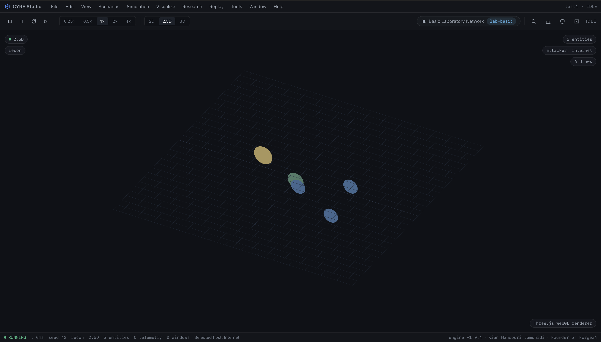
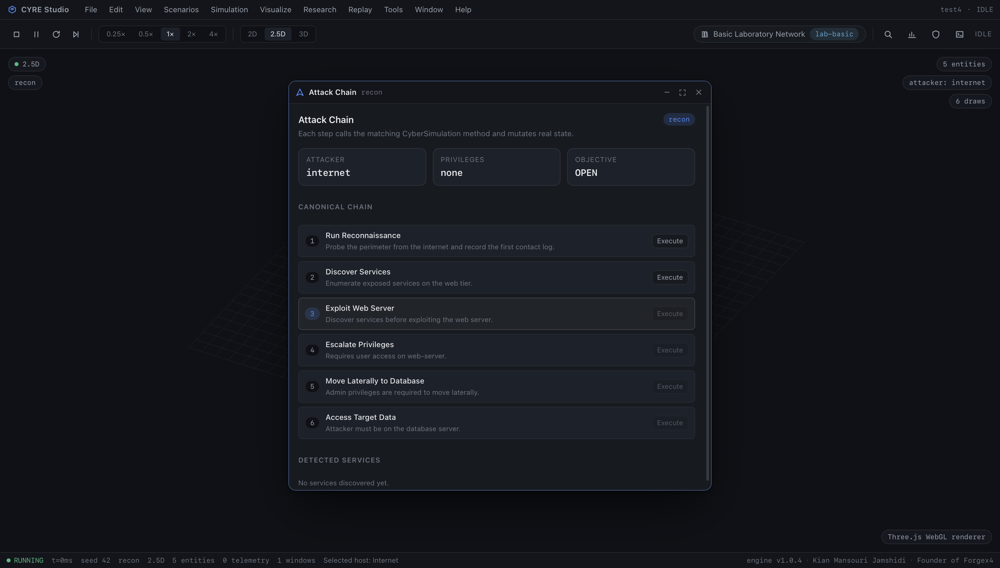
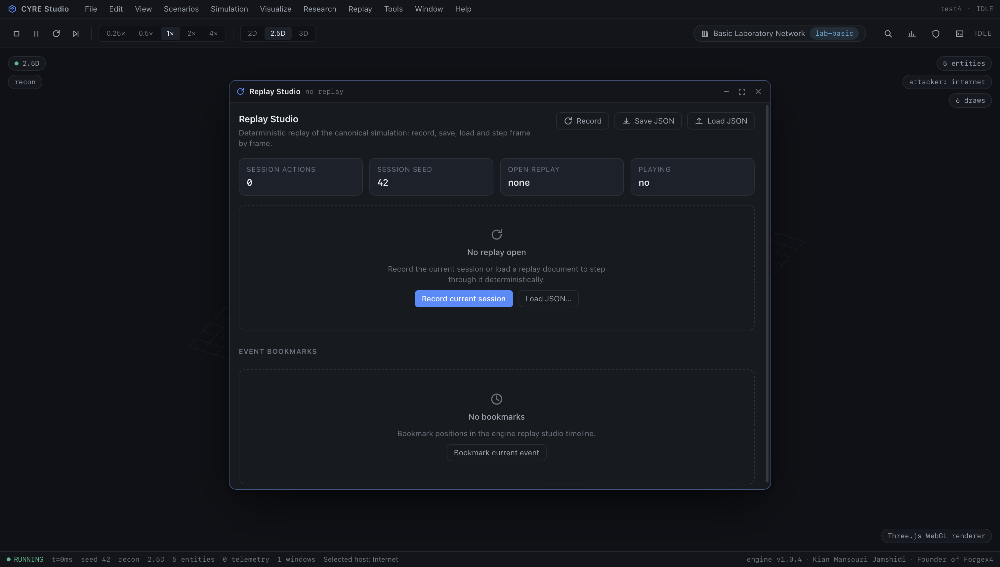
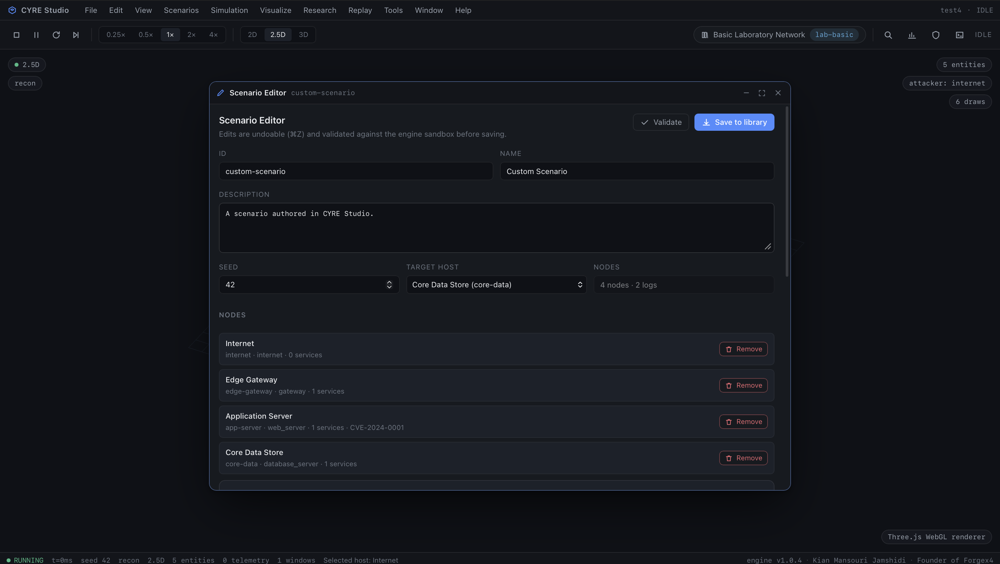
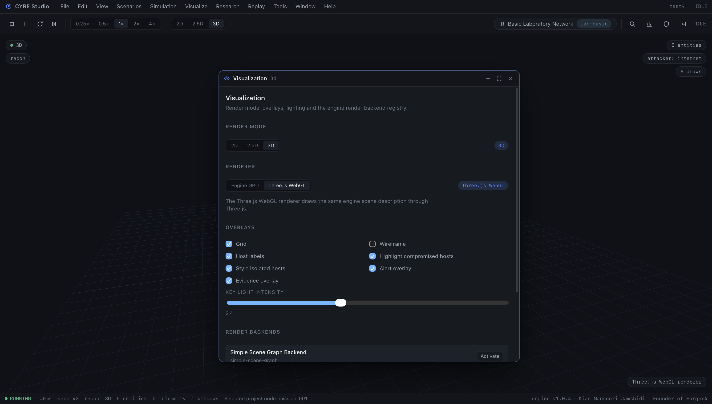
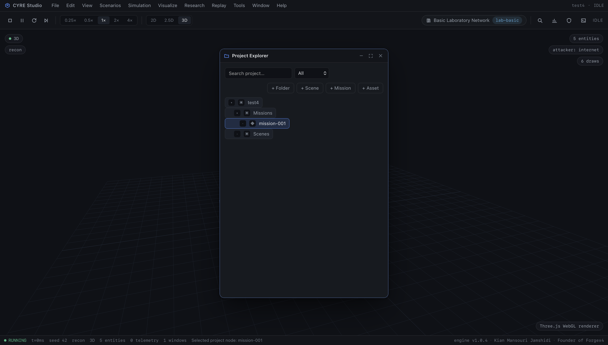
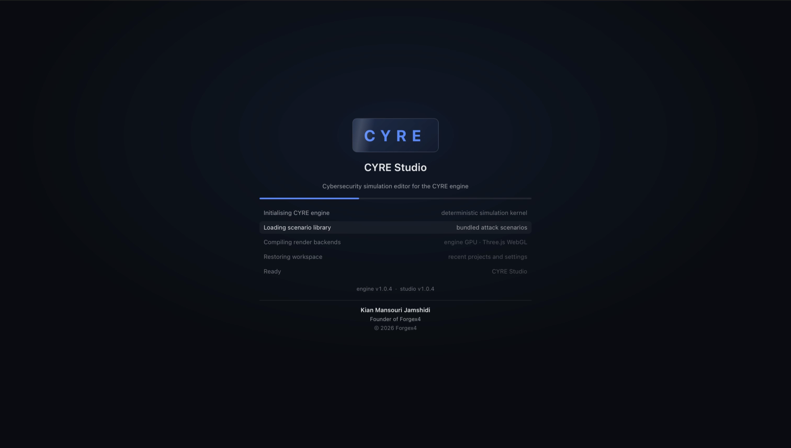

# CYRE — Cybersecurity Reality Engine

**Domain-Specific Game & Simulation Engine for Cybersecurity**

CYRE is a modular, extensible, domain-specific game and simulation engine designed for interactive cybersecurity games, simulations, training systems, and reproducible research.

> **Status:** Verified early functional engine — core cyber simulation, replay, telemetry, research runner, Studio integration, and CI are implemented and tested.  
> Current release: **1.0.4**

---

## Project Identity

- **Project Name:** CYRE — Cybersecurity Reality Engine
- **Developer:** Kian Mansouri Jamshidi
- **Founder:** ForgeX4
- **Repository:** [sirkianmj/cyre-engine](https://github.com/sirkianmj/cyre-engine)
- **License:** Proprietary — All rights reserved
- **Primary Language:** TypeScript
- **Domain:** Cybersecurity simulation, serious games, education, research

---

## Vision

CYRE treats cybersecurity as a first-class engine concept.

It is not a general-purpose game engine. It is a specialized platform for cyber simulation, training, and research.

The engine powers interactive experiences where players and automated agents act as SOC analysts, incident responders, threat hunters, attackers, or security engineers.

---

## Core Objectives

1. **Simulation First**  
   The cyber world maintains real state. Actions mutate state through a canonical simulation runtime.

2. **Domain-Specific by Design**  
   Hosts, services, vulnerabilities, attack stages, evidence, alerts, and defender actions are native engine concepts.

3. **Rendering Independent**  
   The same simulation can be displayed in 2D, 2.5D, or 3D without changing simulation logic.

4. **Deterministic and Reproducible**  
   Seeded RNG, replay recording, and structured telemetry produce repeatable executions.

5. **Cross-Platform**  
   CYRE applications can target web, with desktop and mobile application scaffolds available. Console support is not implemented.

6. **Research-Oriented**  
   Canonical scenarios, telemetry export, replay reproduction, and verified determinism support academic work.

---

## Monorepo Structure

The current workspace contains two pnpm packages:

```text
CYRE
├── engine   # @cyre/engine — simulation kernel, cyber world, replay, research, platform
└── studio   # @cyre/studio — professional React editor and graphical development environment
```

The engine internally organizes cyber simulation, scenario, game, replay, analytics, research, automation, platform, rendering, and editor capabilities as modules.

---

## Technology Direction

- **Core:** TypeScript
- **Frontend / UI:** React + TypeScript
- **Rendering:** WebGL-compatible 2D/2.5D/3D viewports
- **Backend:** Node.js + TypeScript
- **Package Manager:** pnpm
- **Automation:** REST / WebSockets / Webhooks → n8n
- **Verification:** Vitest, Playwright, ESLint, TypeScript strict mode, architecture and placeholder audits

---

## Current Status

CYRE v1.0.4 is implemented and verified as an early functional domain-specific engine. The canonical cyber simulation path works, but some platform-level subsystems remain active development.

CYRE Studio opens through an animated launcher and project manager, then enters the menu/window-based editor with the selected project, render mode, and renderer.

CYRE Studio is a professional simulation editor built around a native-style menu bar and a real windowing system. It opens directly into the 2D/2.5D/3D viewport; every secondary tool — scenario library, scenario editor, simulation control, attack chain, detection & response, host inspector, telemetry, replay, experiment runner, benchmarks, security validation, project, visualization and the authoring/production panels — is a draggable, resizable, minimizable window reached from the menu bar, the ⌘K palette, or a keyboard shortcut. See [`docs/STUDIO.md`](docs/STUDIO.md).

The canonical cyber simulation path is implemented and tested:

```text
Seeded deterministic simulation
        ↓
Scenario / replay initialization
        ↓
Cyber attack chain
        ↓
Detection / evidence / alerts
        ↓
Defender action
        ↓
Objective evaluation
        ↓
Telemetry
        ↓
Replay reproduction
        ↓
Identical final state and event sequence
```

---

## Implemented Roadmap

CYRE has moved from broad architecture into a verified, deterministic cybersecurity simulation engine.

| Sprint | Delivered Capability |
| ------ | -------------------- |
| 1 | Repository verification gates, CI, typecheck, lint, architecture audit |
| 2 | Canonical simulation runtime |
| 3 | Complete state-changing cyber attack chain |
| 4 | Detection, evidence, alerts, defender response |
| 5 | Deterministic seeded RNG and serialization |
| 6 | Real versioned replay system |
| 7 | Reproducible experiment and telemetry pipeline |
| 8 | End-to-end deterministic incident verification |
| 9 | Studio integration with the canonical engine runtime |
| 10 | Production hardening, placeholder audit, v1.0 evidence |

Additional production-readiness capabilities:

- Multi-scenario catalog with selection, load, export, import, authoring and validation.
- Studio Play → CyberSimulation → Viewport workflow.
- Native-style menu bar, real windowing system and ⌘K command palette in Studio.
- Deterministic step mode, seed selection and per-action availability in the GUI.
- In-editor telemetry (JSON/CSV/NDJSON), experiment runner, benchmarks and security validation.
- Playwright E2E tests for dev and production-preview builds.
- Large-network benchmark and machine-readable performance report.
- API stability policy and security sandbox validation.
- Migration compatibility checks for replay and scenario JSON.
- GitHub Actions CI with full verification and browser tests.

## Known Limitations / Active Development

The following areas are functional foundations but not yet fully generalized production subsystems:

- Deterministic ordering is (due time, then action id). Cross-condition inference beyond Welch's t and standardised effect sizes — no error-family correction, mixed models or power analysis — is not implemented.
- The engine GPU renderer covers the cyber network scene — hosts, connections, containment and overlays. Richer scene content (meshes, materials, animation, shadows) is not yet rendered through it; `Renderer3D` still emits command objects for that content.
- The engine GPU renderer currently focuses on the cyber network scene — hosts, connections, containment and overlays. Full mesh/material/animation/shadow pipeline and WebGPU are still future work. 2D/2.5D text labels use a Canvas2D overlay.
- Native bundles cannot be produced in every environment. Real Tauri v2 (`studio/desktop`) and Capacitor 6 (`studio/mobile`) projects exist with build scripts, but producing an `.app`/`.deb`/`.apk` requires the Rust + webkit2gtk and JDK + Android SDK toolchains; where those are absent the scripts report the missing prerequisites and exit non-zero rather than reporting an artifact.
- The canonical attack chain targets the laboratory topology (`web-server` / `database-server`); on scenarios without those hosts the chain steps are disabled with an explanation rather than generalized.

These limitations are tracked in `docs/roadmap.md` and are the focus of future phases.

### Recent milestones

- Real engine GPU rendering with triangle geometry, lighting, and deterministic scene construction.
- State-derived mission scoring replacing all fixed metrics.
- Canonical `SimulationWorld` kernel used by cyber simulation and scenario execution.
- Research analytics with descriptive statistics, effect sizes, and export formats.
- Real Tauri v2 and Capacitor 6 packaging scaffolds.

-

## Verification

Run the full verification pipeline:

```bash
pnpm verify
```

This executes:

```bash
pnpm audit:engine
pnpm audit:placeholders
pnpm lint
pnpm typecheck
pnpm test
pnpm build
```

Run browser E2E tests separately:

```bash
pnpm --filter @cyre/studio test:e2e
pnpm --filter @cyre/studio test:e2e:preview
```

Current verified state:

```text
Architecture audit       PASS
Placeholder audit        PASS  (364 source files)
Engine lint              PASS
Studio lint              PASS
Engine typecheck         PASS
Studio typecheck         PASS
Engine tests             160 test files / 1688 tests
Studio tests             178 test files / 1966 tests
Playwright dev E2E       19 workflows
Playwright preview E2E   2 workflows
Engine build             PASS
Studio build             PASS with chunk-size warning only
Playwright E2E           19 workflows (dev) + 2 (production preview)
```

The Playwright browser binaries are not vendored in this repository. Install
them once per machine before running the E2E suites:

```bash
pnpm --filter @cyre/studio exec playwright install chromium
```

---

## Performance Benchmark

Run:

```bash
pnpm benchmark
```

This produces a JSON report including:

- 200 seeded cyber simulations benchmark
- 1000-host large-network initialization benchmark
- API compatibility check
- Scenario catalog summary

---

## Development

### Prerequisites

- macOS with Xcode Command Line Tools
- Homebrew
- Git
- GitHub CLI
- Node.js 22 or later
- pnpm 11 or later

### Setup

```bash
git clone <repo-url>
cd CYRE
pnpm install
```

### Common Commands

```bash
pnpm verify                            # full verification pipeline
pnpm audit:engine                      # architecture boundary audit
pnpm audit:placeholders                # placeholder audit
pnpm lint                              # ESLint across packages
pnpm typecheck                         # TypeScript typecheck
pnpm test                              # engine + studio tests
pnpm build                             # engine + studio production builds
pnpm benchmark                         # performance benchmark report
pnpm dev:studio                        # run CYRE Studio locally
pnpm --filter @cyre/studio test:e2e         # Playwright development E2E
pnpm --filter @cyre/studio test:e2e:preview # Playwright production-preview E2E
```

---

## Research Goals

CYRE is designed as a research platform for experimentally studying:

- Procedural cybersecurity scenario generation
- Adaptive cyber training
- Human decision-making in simulated cyber environments
- AI agents in cyber defense/attack
- Cybersecurity education effectiveness

The engine records structured telemetry and supports reproducible experiments through seeded execution and replay.

---

## Ownership & Licensing

CYRE is proprietary software owned by **ForgeX4 / Kian M.J.**

All rights reserved. See `LICENSE` and `OWNERSHIP.md` for details.

Third-party notices are documented in `THIRD_PARTY_NOTICES.md`.

Project governance is described in `GOVERNANCE.md`.

---

## Screenshots












All screenshots show the professional CYRE Studio shell, including the launcher, editor, network visualization, attack workflows, replay, and scenario editor.

## Contribution Policy

Contributions are currently closed while the project is in private development.

When public contribution opens, contributors will be required to sign a Contributor License Agreement.

See `CONTRIBUTING.md` for details.

---

## Contact

For inquiries, contact **Kian Mansouri Jamshidi**, founder of **ForgeX4**.

---

## License

Proprietary. All rights reserved. See `LICENSE` for details.
